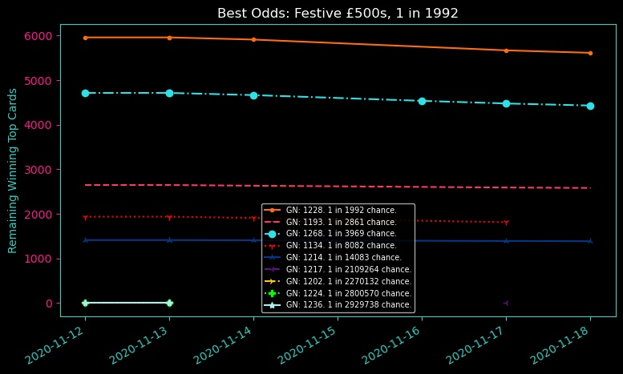

# ScratchCard
## Web, PDF scraper &amp; odds recalculator
- A tool designed to prove my ability with Matplotlib and AWS RDS MySQL
- Also to prove the futility of gambling
 
I thought it was funny that you can buy scratchcards that have no top prizes remaining, and the odds stated on the back are completely false.
There is enough information on the website, and on the scratchcard PDF to get a better idea of the odds.

I decided I'd make a tool to check it daily and give the actual odds (they're terrible :-) )

This project:
- Daily scrapes the national lottery website for current top remaining prizes for each game (and lots of other information)
- Downloads each games PDF guide (about 50 in all) and scrapes the 'total number of cards at launch' and 'odds at launch'
- Stores all the information in an AWS RDS MySQL server, one table for static information. Another table for updating.
- If games are dead, move the Gamenumber, startdate, enddate, 'total cards at launch' to a 'dead' table to ascertain the runtime of a game
- Calculate estimated cards sold per day, assuming 75% of cards would be sold over 2 months: ('Total cards at launch' * .75) / 60
- Use matplotlib to generate a plot for each game displaying 'total cards remaining' and 'remaining top prizes'
- Use matplotlib to generate a plot for the 10 cards with the best odds (nicknamed Megaplot)
- (Nearly finished) Django site updates daily to display the users best options. User can select any card and get its information.

Plots are dark because the site is going to be Outrun colour themed.

Plots are dark because the site is going to be Outrun colour themed.
